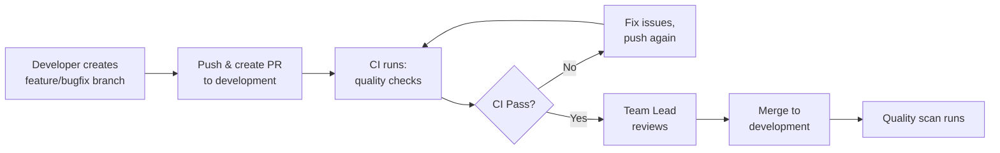

# Developer Workflow & CI/CD Guide

> **Last Updated:** February 2026  
> **Maintained by:** Team Lead

This document explains the complete development workflow, branching strategy, and automated CI/CD processes for the PixArt application.

---

## 📋 Table of Contents

- [Branch Strategy](#-branch-strategy)
- [Developer Workflow](#-developer-workflow)
- [Team Lead Workflow](#-team-lead-workflow)
- [Branch Flow & Promotion](#-branch-flow--promotion)
- [CI/CD Automation](#-cicd-automation)
- [Pull Request Guidelines](#-pull-request-guidelines)
- [Hotfix Emergency Process](#-hotfix-emergency-process)
- [Best Practices](#-best-practices)

---

## 🌳 Branch Strategy

We maintain three permanent branches representing different environments:

```
production (stable, customer-facing)
    ↑
testing (pre-release staging)
    ↑
development (integration & continuous development)
    ↑
feature/*, bugfix/*, chore/* (developer working branches)
```

### Branch Descriptions

| Branch | Purpose | Protected | Who Commits |
|--------|---------|-----------|-------------|
| **production** | Production-ready code, deployed to customers | ✅ Yes | Merges only (from testing) |
| **testing** | Staging environment, final testing before release | ✅ Yes | Merges only (from development) |
| **development** | Integration branch, latest development code | ✅ Yes | Team Lead only (direct commits) + Merges (from PRs) |
| **feature/\*** | New features under development | ❌ No | Individual developers |
| **bugfix/\*** | Bug fixes | ❌ No | Individual developers |
| **hotfix/\*** | Emergency fixes for production | ❌ No | Individual developers |
| **chore/\*** | Maintenance, dependencies, refactoring | ❌ No | Individual developers |

---

## 👨‍💻 Developer Workflow

> **Developers NEVER commit directly to development, testing, or production branches.**

### Step 1: Create Feature Branch

```bash
# Update your local development branch
git checkout development
git pull origin development

# Create a feature branch
git checkout -b feature/add-image-filters

# Or for bug fixes
git checkout -b bugfix/fix-login-crash

# Or for chores
git checkout -b chore/update-dependencies
```

### Step 2: Develop & Commit

Follow conventional commit format:

```bash
# Make your changes
git add .

# Commit with conventional format
git commit -m "feat(filters): add blur and sharpen image filters"
git commit -m "fix(auth): resolve login crash on iOS 16"
git commit -m "chore(deps): update flutter to 3.24.0"
```

**Commit Types:**
- `feat` - New feature
- `fix` - Bug fix
- `chore` - Maintenance (dependencies, config)
- `docs` - Documentation changes
- `refactor` - Code refactoring (no functionality change)
- `test` - Adding/updating tests
- `perf` - Performance improvements
- `style` - Code style changes (formatting)
- `ci` - CI/CD changes
- `build` - Build system changes

### Step 3: Push & Create Pull Request

```bash
# Push your branch
git push origin feature/add-image-filters

# Create PR via GitHub UI or CLI
gh pr create --base development --title "feat(filters): add blur and sharpen image filters"
```

### Step 4: Address CI Feedback

Once you create the PR, automated workflows will run:

#### ✅ Automated Checks (All PRs to development/testing/production)
- Branch name validation
- PR title validation (conventional commit format)
- Commit message validation
- Code formatting check (80-char line limit)
- Flutter analyze (static analysis)
- Security scan (no hardcoded secrets)
- Code duplication detection
- Unit tests with coverage (70% threshold)
- APK build & size check (max 100MB)

#### 🤖 AI Code Review (PRs to testing only)
- Design system compliance (no hardcoded colors/padding)
- Localization checks (hardcoded strings)
- Performance anti-patterns (setState issues, uncached images)
- Inline comments with severity levels (🔴 Blocker, 🟡 Major, 🟢 Minor)

**If checks fail:**
1. Fix the issues locally
2. Commit the fixes
3. Push again - CI will re-run automatically

### Step 5: Code Review & Approval

1. **Automated review** completes (CI must pass)
2. **Team Lead reviews** your PR
3. Address any feedback
4. Get approval ✅

### Step 6: Merge

**Team Lead will merge** your PR into the target branch.

---

## 👔 Team Lead Workflow

As Team Lead, you have additional privileges:

### Direct Commits to Development

```bash
# You can commit directly to development for quick fixes
git checkout development
git pull origin development

# Make changes
git add .
git commit -m "chore: update Firebase config"
git push origin development
```

> **⚠️ Use sparingly:** Even as Team Lead, prefer PRs for significant changes to maintain code review benefits.

### Quality Monitoring

When you push to `development`:
- **Automatic quality scan** runs
- Reports sent to Mattermost
- GitHub issues created if errors found
- You'll receive notifications about code health

### Branch Promotion

You control when code moves between environments:

```bash
# Promote development → testing
git checkout testing
git pull origin testing
git merge development
git push origin testing

# Promote testing → production
git checkout production
git pull origin production
git merge testing
git push origin production
```

---

## 🔄 Branch Flow & Promotion

### Development Phase



**Triggers when code enters development:**
- ✅ Quality scan runs (errors/warnings/coverage report)
- ✅ Mattermost notification sent
- ✅ Weekly dependency check (Mondays)

### Testing Phase

When Team Lead promotes to `testing`:

```bash
git checkout testing
git merge development
git push origin testing
```

**This triggers:**
- ✅ Android build (APK + AAB) → uploaded to AWS S3
- ✅ iOS build (IPA) → uploaded to AWS S3
- ✅ Automated screenshots generation (if integration tests exist)
- ✅ Build notifications to Mattermost

**PRs to testing get:**
- Full CI checks (same as development)
- **Plus:** AI-powered code review with inline comments

### Production Phase

When Team Lead promotes to `production`:

```bash
git checkout production
git merge testing
git push origin production
```

**This triggers:**
- ✅ Android build (APK + AAB) → uploaded to AWS S3
- ✅ iOS build (IPA) → uploaded to AWS S3

### Release Phase

When ready to release:

```bash
# Create and push version tag
git tag -a v1.2.3 -m "Release version 1.2.3"
git push origin v1.2.3
```

**This triggers:**
- ✅ Runs tests
- ✅ Builds APK and AAB
- ✅ Creates GitHub Release with binaries and auto-generated release notes
- ✅ Uploads iOS build to TestFlight automatically

---

## 🚀 CI/CD Automation

### Workflow Triggers Summary

| Event | Branch | Workflows Triggered |
|-------|--------|---------------------|
| **Create PR** | → development | CI checks, PR validation |
| **Create PR** | → testing | CI checks, PR validation, AI code review |
| **Create PR** | → production | CI checks, PR validation |
| **Push** | development | Quality scan, Mattermost notification |
| **Push** | testing | Android build, iOS build, Screenshots |
| **Push** | production | Android build, iOS build |
| **Create tag** | v* | Release creation, TestFlight upload |
| **Schedule** | - | Dependency check (Mondays 10 AM UTC) |

### Automated Processes

#### 🔒 Security Scanning (All PRs)
Detects:
- Google API keys (`AIza...`)
- Hardcoded passwords
- Private keys
- Stripe keys

#### 📦 Dependency Management (Weekly)
- **Patch updates:** Auto-creates PR
- **Minor/Major updates:** Creates issue for manual review
- **Blocked updates:** Reports in issue

#### 📸 Screenshots (Testing Branch)
- Runs integration tests on Linux desktop
- Generates UI screenshots
- Uploads to S3: `s3://bucket/screenshots/{repo}/{version}/{sha}/`

#### 🔔 Notifications
- Mattermost alerts for builds
- Mattermost alerts for quality scans
- OpenClaw webhook for PR events

---

## 📝 Pull Request Guidelines

### PR Title Format

**Must follow conventional commit format:**

```
type(scope): description

Examples:
✅ feat(auth): add biometric login
✅ fix(ui): resolve button alignment on iPad
✅ chore(deps): update dependencies to latest
❌ Add login feature (INVALID)
❌ fixed bug (INVALID)
```

### Branch Naming Rules

```
feature/*   - New features
bugfix/*    - Bug fixes
hotfix/*    - Production emergency fixes (must target production)
chore/*     - Maintenance tasks
release/*   - Release preparation
```

**Examples:**
- `feature/image-filters`
- `bugfix/login-crash-ios16`
- `hotfix/critical-payment-bug`
- `chore/update-dependencies`

### PR Template

Use the [PR template](pull_request_template.md) to ensure all required information is provided.

---

## 🚨 Hotfix Emergency Process

For critical production bugs that can't wait for normal flow:

### 1. Create Hotfix Branch from Production

```bash
git checkout production
git pull origin production
git checkout -b hotfix/critical-payment-bug
```

### 2. Fix the Issue

```bash
# Fix the bug
git add .
git commit -m "fix(payment): resolve critical Stripe integration bug"
git push origin hotfix/critical-payment-bug
```

### 3. Create PR to Production

```bash
gh pr create --base production --title "fix(payment): resolve critical Stripe integration bug"
```

> **⚠️ Validation:** Hotfix branches MUST target `production` branch. PR will fail if targeting any other branch.

### 4. After Merge to Production

**You must backport to other branches:**

```bash
# Merge hotfix into testing
git checkout testing
git merge hotfix/critical-payment-bug
git push origin testing

# Merge hotfix into development
git checkout development
git merge hotfix/critical-payment-bug
git push origin development
```

---

## ✅ Best Practices

### For Developers

1. **Always work on feature branches** - Never commit to development/testing/production
2. **Keep branches up to date** - Regularly merge development into your branch
3. **Write meaningful commits** - Follow conventional commit format
4. **Run tests locally** - Don't rely solely on CI
5. **Keep PRs focused** - One feature/fix per PR
6. **Respond to CI feedback quickly** - Fix issues within 24 hours
7. **Use descriptive branch names** - `feature/add-image-filters` not `feature/new-stuff`

### For Team Lead

1. **Review PRs promptly** - Don't block developer progress
2. **Monitor quality scans** - Check Mattermost notifications daily
3. **Test before promoting** - Manually test on testing before promoting to production
4. **Coordinate releases** - Communicate release schedule to team
5. **Manage dependencies** - Review dependency update issues weekly
6. **Document decisions** - Update this guide when processes change

### Code Quality Standards

- **Line length:** 80 characters maximum
- **Test coverage:** Minimum 70% (warning threshold)
- **APK size:** Maximum 100MB
- **No hardcoded values:** Use design system tokens
- **All strings localized:** Use `.tr` for user-facing text
- **No secrets in code:** Use environment variables

---

## 📊 Developer Cheat Sheet

### Quick Reference

```bash
# Start new feature
git checkout development && git pull
git checkout -b feature/my-feature

# Commit changes
git add .
git commit -m "feat(module): description"
git push origin feature/my-feature

# Create PR
gh pr create --base development

# Update branch with latest development
git checkout development && git pull
git checkout feature/my-feature
git merge development

# Fix CI issues
# ... make fixes ...
git add .
git commit -m "fix: address CI feedback"
git push
```

### Common Scenarios

**Scenario:** CI says "Branch name invalid"
- **Fix:** Rename branch to `feature/*`, `bugfix/*`, or `hotfix/*`

**Scenario:** CI says "PR title invalid"
- **Fix:** Update PR title to format: `type(scope): description`

**Scenario:** CI says "File not formatted"
- **Fix:** Run `dart format --line-length 80 .` and commit

**Scenario:** CI says "Hardcoded color detected"
- **Fix:** Use design system colors instead of `Color(0xFF...)`

**Scenario:** CI says "Coverage below 70%"
- **Fix:** Add tests or it's just a warning (won't block merge)

---

## 🆘 Getting Help

- **CI/CD Issues:** Check workflow logs in GitHub Actions tab
- **Process Questions:** Ask Team Lead
- **Workflow Updates:** This document is versioned - check git history
